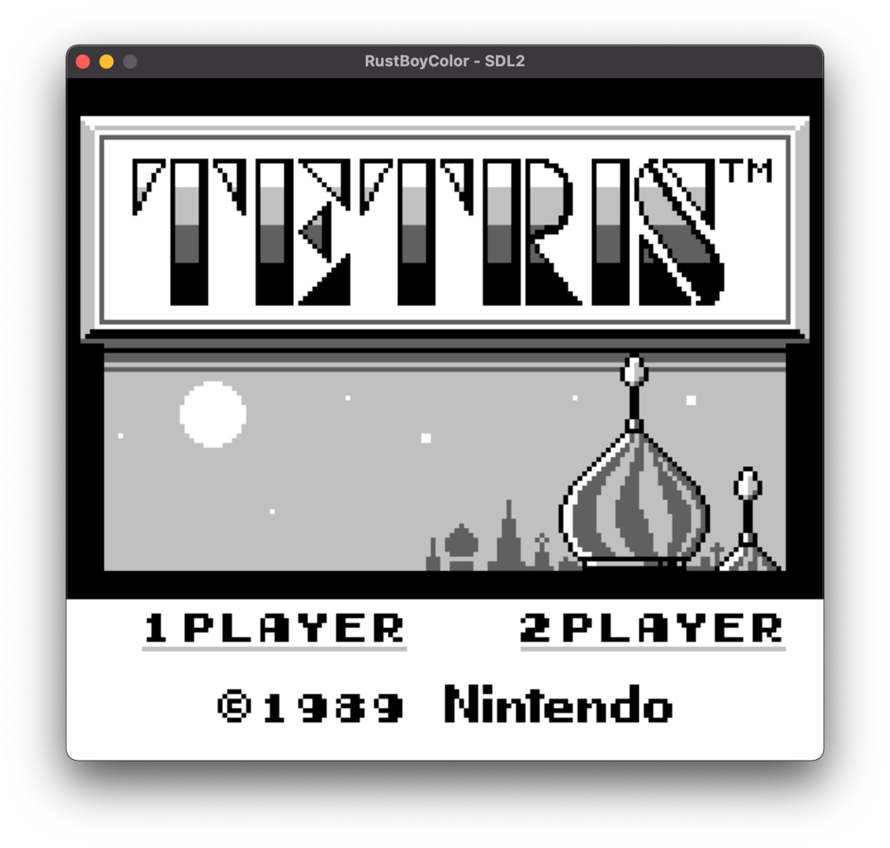

# rustboycolor 

Simple Game Boy (Color) emulator written in Rust.

## Dependencies

- Rust: compiled against the latest [Rust _stable_ branch][rust-stable]. The latest nightly should work too.
- Cargo: Rust package manager.
- SDL2: requires the development libraries and the associated [Rust binding][rust-sdl2].

[rust-stable]: https://github.com/rust-lang/rust/tree/stable
[rust-sdl2]: https://github.com/AngryLawyer/rust-sdl2

## Main References

- Pandoc: <http://bgb.bircd.org/pandocs.html>
- Complete [Opcode tables](http://www.pastraiser.com/cpu/gameboy/gameboy_opcodes.html)
- More technical information: <http://fms.komkon.org/GameBoy/Tech/>
